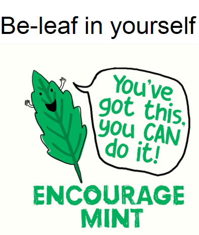

# To-Do's

#### Assignment Changes
* [ ] *Joker* articles must go
  * Sub for movie review?
  * Visual analysis (visual rhetoric?) no longer requirement
* [ ] Eliminate reading reflection?
  * Or, alternately, better plan for implementing it (lesson plans here)
* [ ] Portfolio assignment
  * Portfolio assignment - better assignment sheet, host of options
  * Figure out portfolio submission
  * (Could *another* revision at the end of the semester be productive? A revision & reflection?)
* [ ] Research paper: still good; keep annotated bib; perhaps a reformatted genre, though? Or call it differently?
  * Definitely incorporate the librarian differently

##### 6 “writing with” assignments, 30% of grade, 2 weeks apiece (draft, repair): day in the life, social media, documentary, readings, presentation, objects

##### Possibilities
* Multimodal (a la Shipka?)
* Object/descriptive analysis
* Reformatted presentation
  * Not "presentation week" but distributed?

#### Reading Adjustments
* [ ] Alter dates for themed readings - i.e. Barthes for V-Day
* [ ] Better interviews (for goodness' sake!)
* [ ] Cluster-theme readings
* [ ] Add readings and **functioning links to readings**

#### Syllabus Adjustments
* [ ] Update language in syllabus - esp. portfolio verbiage, course outcomes
* [ ] Reconfigure percentages
* [ ] Fix participation, draft document for best practices on Zoom
* [ ] Update info about UBLearns
* [ ] Eli Review
  * Clear punishments for different degrees of late work
* [ ] Add journal to requirements
  * And journaling language somewhere
* [ ] Select and update office hours
* [ ] **At the end**, fix pagination for print version
  * Also craft printable copy of full reading list

